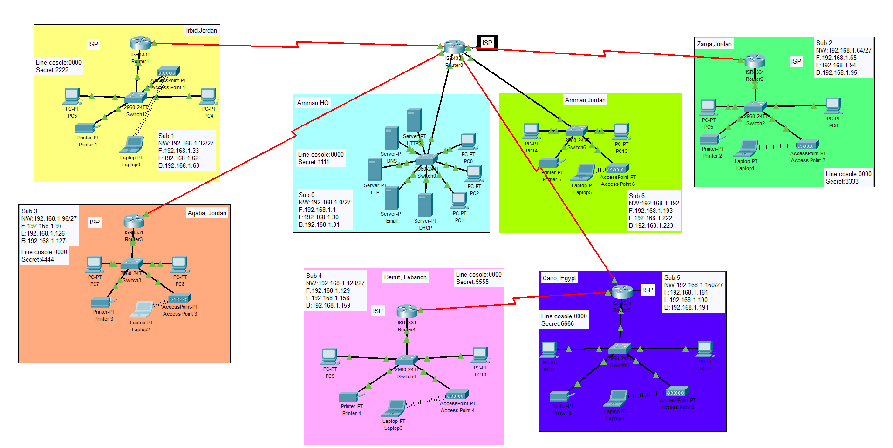

<h1>Baisc-Networking-Topology</h1>


# 🌐 ConnectX Enterprise Network Design (Cisco Packet Tracer)

<p align="center">
  <a href="Topology_image/Network_Topology.png" target="_blank">
    
  </a>
</p>

## 📌 Project Overview
This project presents the design and implementation of a secure, scalable, and efficient enterprise network for ConnectX. The network connects multiple branch offices across different cities to a central headquarters (HQ) using a Wide Area Network (WAN). The goal is to ensure reliable communication, centralized services, and secure access to internal resources.

## 🏗️ Network Design
The network follows a hub-and-spoke topology, where all branch routers are connected to a central router at the HQ. This design simplifies management, improves control, and allows easy scalability for future expansion.

* **WAN Addressing:** Implemented using `/30` subnets for point-to-point links.
* **LAN Addressing:** Subnetted based on branch size and requirements.
* **Loopback Interfaces:** Used for stable router identification and routing.

## ⚙️ Technologies & Protocols Used
* **Routing Protocol:** OSPF (Open Shortest Path First) for dynamic routing and fast convergence.
* **IP Addressing:** VLSM-based subnetting for efficient IP allocation.
* **DHCP:** Automatic IP address assignment for end devices.
* **DNS:** Domain name resolution (`eis.connectx.com`).
* **HTTP/HTTPS:** Secure access to internal web services.
* **FTP:** File sharing across branches.
* **Email Services:** Internal communication between users.

## 🖥️ Network Services
The HQ hosts centralized servers that provide:
* 🌐 **Web Server** – Internal system access via HTTPS.
* 📡 **DNS Server** – Resolves domain names to IP addresses.
* 📥 **DHCP Server** – Dynamically assigns IP addresses.
* 📁 **FTP Server** – Enables file transfer between branches.
* 📧 **Email Server** – Supports internal communication.

## 🔐 Security Features
* Static IP assignment for critical devices (servers, routers).
* Basic password protection for routers and switches.
* Network segmentation using subnetting.
* Foundation for future enhancements (ACLs, SSH, firewall).

## 🧪 Testing & Validation
The network was tested using:
* `ping` for connectivity.
* `traceroute` for path verification.
* DNS resolution tests.
* Web browser access to internal services.

All services were validated to ensure proper communication between branches and HQ.

## 🚧 Challenges & Lessons Learned
* Resolving routing issues between different subnets.
* Avoiding IP address conflicts through proper planning.
* Configuring DHCP relay for remote branches.
* Understanding the importance of structured network design.

## 📈 Future Improvements
* Implement multi-area OSPF for better scalability.
* Add redundancy to eliminate single points of failure.
* Enhance security with ACLs and SSH.
* Introduce VLANs for better network segmentation.

## 📂 Tools Used
* Cisco Packet Tracer
* Networking concepts (OSI model, TCP/IP, subnetting)

## 🎯 Conclusion
This project demonstrates the practical implementation of enterprise networking concepts, including routing, addressing, and service deployment. It highlights the importance of planning, scalability, and security in modern network design. 


<!--
 ```diff
- text in red
+ text in green
! text in orange
# text in gray
@@ text in purple (and bold)@@
```
--!>
